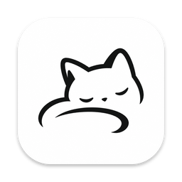

  

<h1 align="center">just chat.</h1>

An intuitive LLM chat client.

  <code>curl -fsSL https://im.linghaoz.com/install.sh | sh</code>

macOS 13+ · Apple silicon and Intel · <a href="https://im.linghaoz.com">im.linghaoz.com</a>

Windows 10/11 · x64 · <a href="https://github.com/yetlinghao/im/releases/latest/download/im_x64-setup.exe">Download installer</a>

 

- Any endpoint that speaks Chat Completions, Anthropic Messages or Responses. Your keys stay on your computer.
- Every conversation is one plain JSON file — readable, diffable, replayable.
- Native windows, menus, shortcuts and system fonts. Nothing that isn't content.

 

<a href="docs/DEVELOPMENT.md">Building, data format, protocols, releasing →</a>

